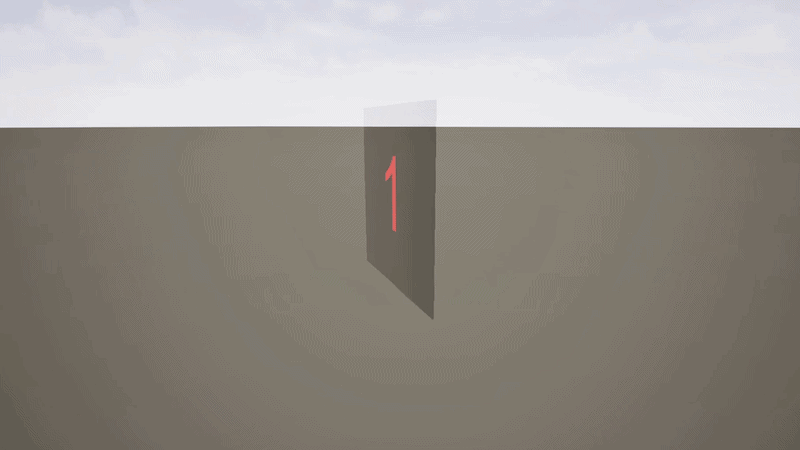
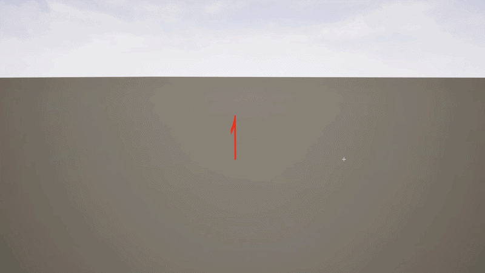

\# UE5 Two Sided Flipbook Shader

A free Unreal Engine 5 shader designed rotating, double sided, flipbooks. No mirror effect!

\## Preview

\## Features

\- Ready-to-use master material

\- Demo map included

\- Organized Unreal Engine folder structure

\- Easy to customize

\- Suitable for rotating, double sided, flipbooks

\## Included

\- Master material

\- Example demo map
- Texture, Sprites and Flipbook samples
- Rotating BP as example

\## Unreal Engine Version

Tested in Unreal Engine 5.4

\## Installation

\### Option 1: Open the sample project

1\. Download or clone this repository.

2\. Open the `P\_TwoSidedFlipbook.uproject` file.

3\. Open the demo map located in `Content/`.

\### Option 2: Migrate to your own project

1\. Open this project in Unreal Engine.

2\. Right-click the `Content\\TwoSidedFlipbook` folder.

3\. Choose \*\*Migrate\*\*.

4\. Select the `Content` folder of your own Unreal project.

5\. Open your project and use the material instances.

\## How to Use

1\. Open the TwoSidedFlipbook map.

2\. Duplicate one of the material instances.

3\. Replace the Source Flipbook in the BP\_TwoSidedFlipbook by yours.

\## License

MIT License. Free to use in personal and commercial projects.

